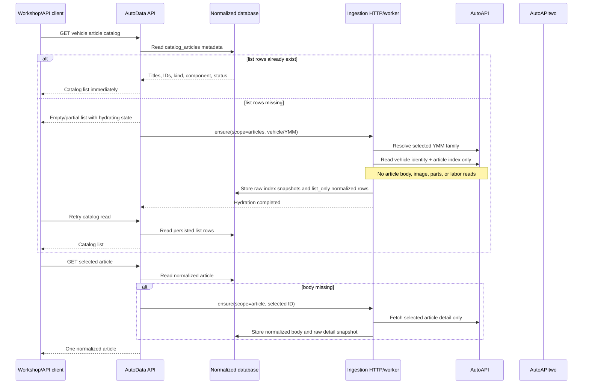

# Article catalog list-only hydration

The workshop treats article discovery and article content as two separate operations:

The dangerous path was the generic catalog dispatcher. When it received
`scope=articles`, it had no article-index method to call, so it fell through to
`fetch_catalog_snapshot()`/`fetch_catalog()`. AutoAPI's snapshot walks years,
makes, models, vehicles, and article indexes across the entire source. That is
appropriate for an explicitly requested background snapshot, but it is not a
valid response to one selected vehicle's article-list request.

The article scope now has a narrow boundary. It reuses the existing targeted
AutoAPI vehicle-family resolver and `fetch_vehicle_bundle`, whose resources are
the vehicle identity endpoints and the vehicle article index. Calling it with
an empty article query means the worker does not enter the selected-article
loop in `_load_autoapi_job_catalog`. AutoAPItwo remains available for selector
hydration; because its current connector exposes no article-index operation,
the article scope must skip it rather than invoking its fleet snapshot.

The database remains the source of truth after hydration. Index rows carry
their original source snapshot and normalized metadata, and remain
`list_only` until the selected-article endpoint explicitly retrieves and
normalizes the corresponding detail. This keeps catalog browsing cheap while
retaining the existing source provenance and one-time ingestion behavior.

Tracking: https://github.com/lucronn/autodata/issues/113 in https://github.com/users/lucronn/projects/8.
Plan: `docs/superpowers/plans/2026-09-26-article-catalog-list-only-hydration.md`.

Todo: add the list-only boundary; reuse bounded AutoAPI index persistence; add no-fan-out regression tests; rebuild and verify the live cold catalog and selected detail paths.
