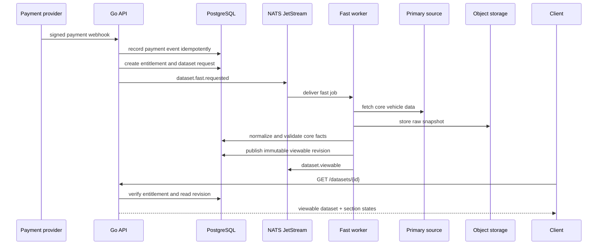
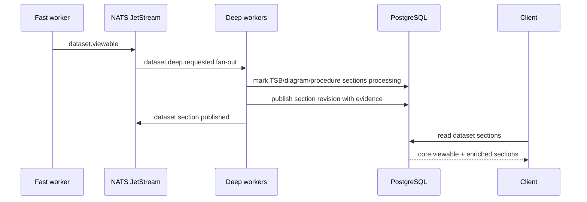
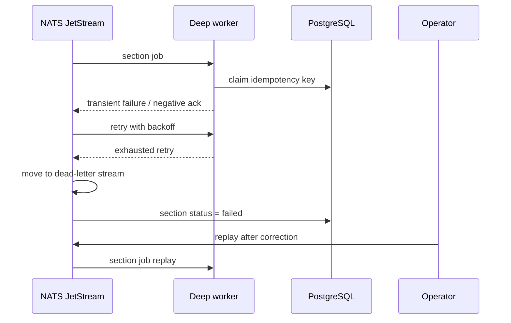
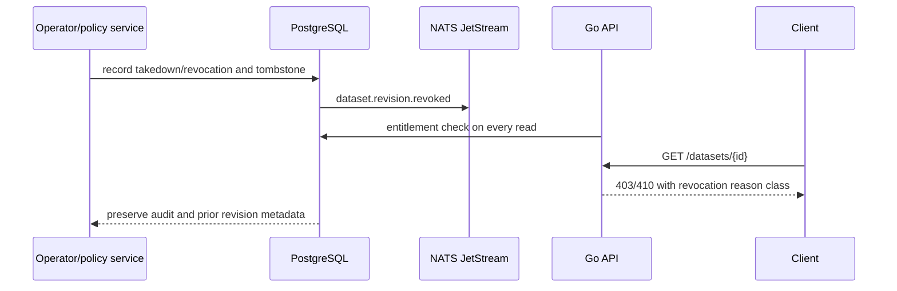
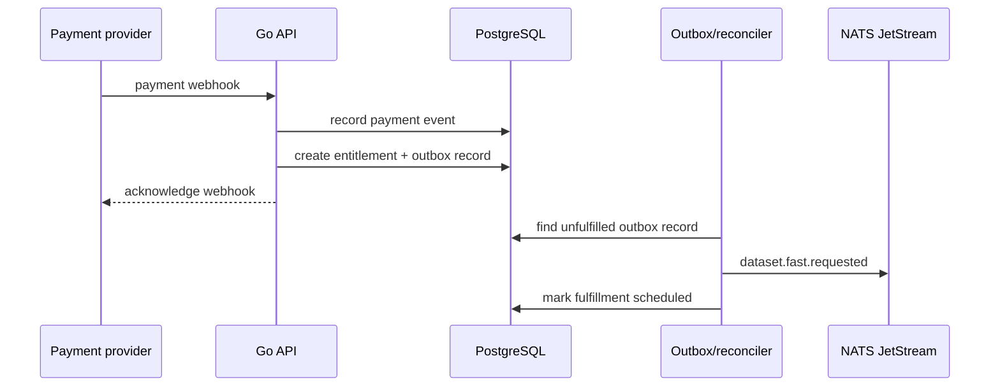

# AutoData Dataset Lifecycle

## Lifecycle contract

The purchaser-facing unit is a vehicle-specific dataset projection selected by make, model, year, and region. A one-time purchase creates an entitlement to that projection and its permitted future enrichment revisions. The first usable revision is produced by the fast lane; the deep lane enriches it without blocking access.

```text
Payment success
  -> entitlement created
  -> dataset request created
  -> fast-lane job scheduled
  -> primary source fetched
  -> vehicle identity/core facts normalized
  -> minimum viewable contract validated
  -> projection revision published
  -> user can view dataset
  -> deep-lane jobs fan out
  -> TSBs, images, diagrams, wiring, procedures,
     evidence, embeddings, and quality checks publish incrementally
```

## Overall states

| State | Meaning | Allowed next states |
| --- | --- | --- |
| `purchased` | Payment is confirmed and an entitlement exists; work has not begun | `fast_lane_processing`, `failed`, `revoked` |
| `fast_lane_processing` | The minimum viewable dataset is being fetched, normalized, and validated | `viewable`, `failed`, `needs_review`, `revoked` |
| `viewable` | The minimum contract is published and readable by the entitled purchaser | `enriching`, `complete`, `revoked` |
| `enriching` | One or more deep sections are being processed | `complete`, `viewable`, `needs_review`, `revoked` |
| `complete` | All product-declared sections have a successful published revision | `revoked` |
| `failed` | A required lane failed and needs retry or operator action | `fast_lane_processing`, `needs_review`, `revoked` |
| `needs_review` | Validation, confidence, source drift, or policy requires human action | `fast_lane_processing`, `enriching`, `viewable`, `revoked` |
| `revoked` | Access or publication was withdrawn for refund, takedown, policy, or administrative reason | none |

`viewable` is monotonic with respect to access: once an entitled user has a valid viewable revision, a deep-lane failure does not take the dataset back to an unavailable state. Revocation is an explicit policy transition, not a processing failure.

## Section states

Every product section has its own state: `pending`, `processing`, `viewable`, `complete`, `failed`, or `needs_review`. A dataset may be `viewable` while diagnostics, TSBs, diagrams, and embeddings remain `processing`. The API returns these states so a client can render partial availability accurately.

The product definition declares the minimum viewable set. The default reference set is vehicle identity, source metadata, core specifications, and the product's explicitly required base sections. Deep material such as TSBs, image/diagram extraction, wiring topology, procedures, evidence indexing, and semantic embeddings is not required for first view unless a product explicitly includes it in its minimum contract.

## Fast lane

1. Accept a payment confirmation only after webhook signature verification and idempotent event recording.
2. Create or reuse the entitlement using the payment event's stable provider ID.
3. Create or reuse a dataset request for the vehicle selector and product.
4. Fetch the primary source using a source adapter with a checkpoint and source watermark.
5. Store the raw source snapshot and content hash in object storage and PostgreSQL.
6. Normalize identity, applicability, source metadata, and core facts.
7. Validate required fields, source identity, units, referential relationships, and minimum confidence.
8. Publish an immutable viewable projection revision.
9. Emit `dataset.viewable` and schedule deep-lane work.

Fast-lane work is successful only when the minimum viewable contract is valid. A source timeout, schema mismatch, missing vehicle match, or unresolvable ambiguity results in `failed` or `needs_review`, never a false `viewable` state.

## Deep lane

After viewable publication, the request fans out to independent enrichment jobs for:

- TSB and diagnostic extraction.
- PDF/image OCR and page-level evidence.
- Repair procedures, safety warnings, torque/spec references, and media.
- Wiring diagrams, harnesses, connectors, pins, splices, grounds, and network topology.
- Parts, tools, software flashes, and maintenance schedules.
- Embeddings and retrieval indexes.
- Cross-record validation and human-review queues.

Each section can publish independently. A successful section publication creates a new immutable revision or an explicitly linked section revision, updates section status, records its source watermark and changelog, and emits `dataset.section.published`. A failed section is retried with bounded backoff, then sent to a dead-letter stream and marked `failed`; the last successful section revision remains readable.

## Idempotency and checkpoints

The stable processing key is:

```text
source_snapshot_id + dataset_request_id + lane + processing_version
```

Handlers must use an inbox or equivalent deduplication record before applying side effects. Source adapters checkpoint pagination/page ranges. Document workers checkpoint per document/page. Publication uses a compare-and-publish operation so a duplicate event cannot create two revisions for the same input key.

## Sequence diagrams

### Successful purchase and fast-lane publication



### Fast publication followed by deep enrichment



### Deep retry and dead-letter handling



### Takedown or entitlement revocation



### Payment success with delayed fulfillment


