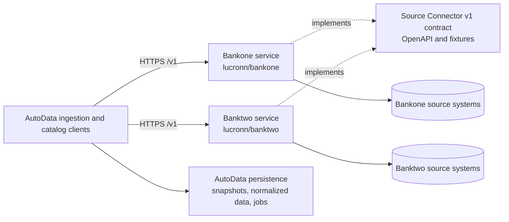

# Independent Bankone and Banktwo connectors

AutoData is the application and system of record. It calls Bankone and Banktwo
independently over the provider-neutral Source Connector v1 HTTP contract.
Each bank owns its upstream access, source-specific parsing and search, private
credentials, retries, caching, and source API. A bank does not call the other
bank, import AutoData code, or access AutoData persistence.

There is no Bankone-to-Banktwo or Banktwo-to-Bankone edge. The dashed contract
edges indicate that both independent services implement the same specification;
the contract is not a runtime service.

## Component locations

| Responsibility | Current location |
| --- | --- |
| Canonical wire contract and fixtures | [`packages/contracts/source-connector/v1/openapi.yaml`](../../packages/contracts/source-connector/v1/openapi.yaml), `packages/contracts/source-connector/v1/fixtures/` |
| Contract inventory and persisted provider mapping | [`packages/contracts/contract.json`](../../packages/contracts/contract.json) |
| AutoData HTTP client, validation, and provider registry | `workers/ingestion-python/src/autodata_ingestion/source_connector_client.py` |
| AutoData catalog callers | `workers/ingestion-python/src/autodata_ingestion/catalog_service.py`, `catalog_sync.py`, `catalog_years.py` |
| AutoData generic fetch-job store and additive import | `workers/ingestion-python/src/autodata_ingestion/source_job_persistence.py`, `db/migrations/036_source_fetch_jobs.sql` |
| AutoData runtime origin defaults | `.env.example`, `infra/compose/compose.yaml`, `infra/k8s/base.yaml` |
| Bankone source API and deployment | Independent repository [`lucronn/bankone`](https://github.com/lucronn/bankone); its checkout is not part of this AutoData tree |
| Banktwo source API and deployment | Independent repository [`lucronn/banktwo`](https://github.com/lucronn/banktwo); its checkout is not part of this AutoData tree |

The contract defines `GET /v1/capabilities`, `GET /v1/catalog/{scope}`,
`POST /v1/vehicle-resolutions`, vehicle-scoped article list/search, and
`GET /v1/resources/{opaqueRef}`. Its probes are `/healthz` and `/readyz`.
The OpenAPI document defines these paths; their live availability has not been
verified in this worktree.

## Names and persistence

Wire provider slugs are `bankone` and `banktwo`. AutoData maps them to the
historical persisted lineage values `autoapi` and `autoapitwo`, respectively.
These stored identifiers, article and snapshot identities, source versions,
locators, and historical migrations remain compatibility data. Their continued
presence does not mean AutoDBone or AutoDBtwo are current service names.

The contract carries opaque source references, source revision, fetched time,
request ID, and source locator. AutoData passes opaque references back to the
same bank; it does not interpret them as upstream URLs or identifiers. Resource
responses include original content or bytes, media type, and SHA-256. The
AutoData client validates the envelope and hash, then the ingestion pipeline
owns source snapshots, normalization, provenance, review, and object storage.
Provider asset references are fetched through that bank's resource endpoint;
they are not forwarded to the other bank.

AutoData uses the provider-neutral `source_fetch_jobs` table. Migration
`036_source_fetch_jobs.sql` imports historical Bankone rows while preserving
their UUIDs, idempotency keys, retry state, and snapshot links. The legacy
`autoapi_article_fetch_jobs` table is retained for compatibility and rollback;
it is not a bank-owned database or a reason for either bank to receive database
credentials.

## Local configuration and live status

The AutoData defaults are `https://bankone.cars.tk` and
`https://banktwo.cars.tk`, configured independently with `BANKONE_BASE_URL` and
`BANKTWO_BASE_URL`. Compose passes both values to ingestion services, Kubernetes
sets both values in its ConfigMap, and `.env.example` documents the defaults.
The client can also read `BANKONE_API_TOKEN` and `BANKTWO_API_TOKEN` from its
environment when an origin requires bearer authentication; no token values are
committed in the example configuration.

These are configured origins, not proof of live domains. As of this document's
local repository inspection, production DNS ownership, Vercel domain
attachments, TLS, deployed health/readiness, connector authentication, release,
and independent Bankone/Banktwo canaries remain **pending**. No production
deployment or live canary is claimed here. The old `cars.tk/bankone` and
`cars.tk/banktwo` shared-path arrangement and Banktwo-owned Bankone rewrite are
not the current target topology; do not infer that the apex or either subdomain
is attached to a particular project.

See the [design spec](../superpowers/specs/2026-10-08-independent-bank-connectors-design.md),
[implementation plan](../superpowers/plans/2026-10-08-independent-bank-connectors.md),
[API compatibility details](source-connector-api-compatibility.md), and
[domain status](bankone-banktwo-domain-routing.md).
